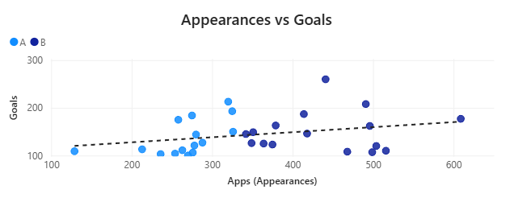

#  Football Player Efficiency Analysis (Power BI)

## Project Overview

Most football analysis focuses on **total goals scored**.
This project challenges that assumption.

Instead of asking:

> “Who scored the most goals?”

This project asks:

> **“Who is actually more efficient at scoring?”**

Using historical player data, this analysis compares performance across groups to uncover **hidden inefficiencies and misleading metrics**.

---

## Objective

The goal of this project is to:

* Evaluate player performance using **goals per game (efficiency)**
* Compare two player groups (A vs B)
* Identify whether **higher output actually means better performance**
* Demonstrate how **raw totals can mislead decision-making**

---

## Key Insight

Group B players have **higher total goals**, but:

They are **less efficient** than Group A

* **Group A Efficiency:** 0.51 goals/game
* **Group B Efficiency:** 0.34 goals/game

This reveals a critical insight:

> **More output ≠ Better performance**

---

## Visual Analysis

### 1. Efficiency Comparison


* Clear performance gap between groups
* Group A consistently outperforms in efficiency
* Highlights why averages alone can be misleading

---

### 2. Appearances vs Goals per Game



* Shows relationship between experience (appearances) and scoring rate
* Slight downward trend suggests:

  * Efficiency may decrease with more matches
  * Role, fatigue, or team dynamics may impact performance

---

## Key Learnings

* **Raw metrics can be deceptive**
  Total goals do not reflect true performance quality

* **Efficiency metrics are more meaningful**
  Goals per game provides a normalized comparison

* **More data ≠ better insights**
  Without the right metric, analysis becomes misleading

* **Data storytelling matters**
  The same dataset can lead to completely different conclusions

---

## Tools & Technologies

* **Power BI** – Dashboard creation & visualization
* **Data Cleaning** – Structured player dataset
* **Basic Statistical Analysis** – Ratio metrics, comparisons

---

##  Project Structure

```
Football-Player-Efficiency-Analysis/
│
├── Assets/                # Images used in README
├── Dataset/               # Raw data
├── Power BI File/         # .pbix dashboard
├── Insights/              # Key findings
└── README.md
```

---

##  How to Use

1. Download the Power BI file from the repository
2. Open it using Power BI Desktop
3. Explore:

   * Player-level metrics
   * Group comparisons
   * Interactive filters

---

##  Conclusion

This project demonstrates that:

> **Performance should not be measured by volume alone, but by efficiency.**

By shifting focus from totals to ratios, we uncover **more accurate and meaningful insights**.

---

## Future Improvements

* Add advanced metrics (xG, assists, contribution index)
* Perform clustering of player types
* Build predictive models for player performance
* Expand dataset across leagues and seasons

---

## Author

**Ayush Kaushik**
Aspiring Data Analyst / AI Engineer

---
